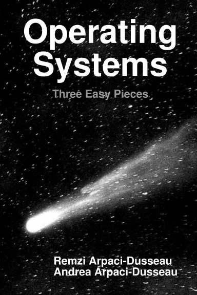

# OS Study

## 📖 교재

- **Operating Systems: Three Easy Pieces (OSTEP)**

- [원서](https://pages.cs.wisc.edu/~remzi/OSTEP/) | [한글 번역서](https://product.kyobobook.co.kr/detail/S000001732402)

## 📜 스터디 진행 방식

- [Repository](https://github.com/Sushi3-CS/Operating-Systems)에 각자 각 장별로 공부한 내용을 정리합니다.
- 단, 바로 main 브랜치에 push 하는 것이 아니라 PR을 생성해서 다른 팀원들에게 review 요청합니다.
- 과반수가 approve 하면 PR merge해주세요.
- 각자 다른 팀원들 글을 review 하면서 잘못되었거나 부족해 보이는 부분에 대해 부담없이 comment 로 보충하고 토의했으면 좋겠습니다.
- 오프라인 미팅은 매주 월요일 오후 12시에 진행합니다.
- 미팅은 진도별로 공부했던 내용에 대해 공유하는 자리입니다.
- 문제는 전부 풀어오는 것이 필수는 아니나, 문제 선별시 당일 아침까지 톡방에 선정한 문제 번호를 공유해주세요.
- 발표에 대한 자세한 내용은 아래를 참고해주세요.

## 🎙 발표

- 발표자 기준으로 진행이 되나, 다른 팀원들도 공부해와야 합니다.
- 발표 길이는 길지 않아도 무방합니다. (훑는 정도여도 무방, 발표 부담 줄이기)

| Week | 일정 | 내용 | 발표자 | 교재 챕터 |
| ---- | --- | --- | ----- | -------- |
| 1 | 9/11 | Introduction to Operating Systems, The Process, Process API Limited Direct Execution, Scheduling: Introduction, MLFQ | 김현준 방형욱 | |
| 2 | 9/18 | Scheduling: Proportion Share, Multiprocessor Scheduling, Address Spaces Memory API, Address Translation, Segmentation | 김민균 김건희 | |
| 3 | 9/25 | Free-Space Management, Paging: Introduction Paging: Faster Translations, Smaller Tables, Mechanisms Swapping: Policies, Concurrency, Thread API | 박정환 박성현 | |
| 4 | 10/9 (비대면) | Locks, Lock-based Concurrent Data Structures Condition Variables, Semaphores | 김현준 방형욱 | |
| 5 | 10/16 | Common Concurrency Problems, I/O Devices Hard Disk Drives, RAIDs | 김민균 김건희 | |
| 6 | 10/30 | File and Directories, File System Implementation Locality and The Fast File System, Crash Consistency Log-structured File Systems, Flash-based SSDs | 박정환 박성현 | |

## 🗂 Conventions

- 각 챕터별 디렉토리에 각자 정리한 내용을 올려주세요.
- 디렉토리명은 해당 챕터명입니다. (e.g. `Chapter 3 - 가상화에 관한 대화`)
- markdown 파일은 `ch1_읍읍읍.md`으로 생성해주세요.
- markdown에 필요한 asset들은 챕터별 디렉토리 안에 asset 디렉토리를 따로 생성해서 거기에 올려주세요.
- PR 만드실 때 브랜치는 main에서 `ch1_읍읍읍`으로 생성해주세요.
- Commit message는 특별한 규정을 두지 않겠습니다.
  
## 🥤 페널티

- 불참 OR 해당 주차 학습을 못했을 시 해당 주차 혹은 그 다음 주차에 커피 한잔씩 돌리기

## Reference

- [KAIST EE415](https://oslab.kaist.ac.kr/ee415-spring-2020/)
- [OSSU OSTEP](https://github.com/ossu/computer-science/tree/master/coursepages/ostep)
- [lyndon316's note](https://lyndon316.notion.site/25-98bb50c2a09d4151a11fb5bc41cacfe2?pvs=4)
- [KU CYDF216]() <!-- Should be filled after Announcement -->