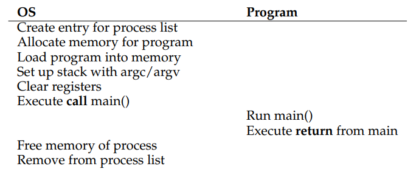

# Chapter 6

- Basic Technique : Limited Direct Execution
    
    OS가 빠른 프로그램 실행을 위해 직접 실행, 즉 Program Counter가 프로그램의 특정 부분을 직접 가리켜 실행시킨다는 의미이다.
    
    
    
    따로 제한을 걸지 않으면 위와 같이 실행이 이루어진다.
    
    즉, 프로세스는 시작부터 끝까지 한 번에 실행되지만, 중간에 OS가 끼어들 수 없다.
    
- Problem #1 : Restricted Operations
    
    앞선 LDE를 통해 프로그램을 실행하면 OS가 간섭할 수 없어 I/O 등의 행동을 제어할 수 없어진다.
    
    따라서 User mode와 Kernel mode가 필요하다.
    
    - User mode : I/O, 자원 요청 등의 작업 수행 불가능.
    - Kernel mode : 권한이 필요한 모든 작업 수행 가능
    
    다만, 프로세스를 User mode로 실행한다면 해당 프로세스에 필요한 I/O까지 막힐 수 있다. 따라서, OS는 system call과 trap 시스템을 활용해 이러한 기능들을 제한적으로 가능하도록 처리한다.
    
    이러한 trap을 통해 system call을 실행하더라도 문제가 있다. system call이 종료되면 OS는 프로세스를 원래 상태 그대로 돌려놓아야 하기에, 레지스터 값 등 저장이 필요한 정보를 kernel stack 등에 넣어 두어야 한다.
    
    또한, trap이 발생한 경우 어느 위치의 코드를 실행해야 할지도 알고 있어야 한다. OS는 이러한 코드의 위치를 프로세스에게 직접적으로 노출해서는 안 되니, 하드웨어에게 직접적인 위치를 알려준 후, 소프트웨어는 trap 발생 시 하드웨어에게 접근하게 된다.
    
    
    
    이러한 trap 과정들을 통해 프로세스 실행 방식을 나타내면 위와 같다.
    
- Problem #2 : Switching Between Processes
    
    앞서 프로세스 내에서 권한과 관련된 작업은 가능해지지만, 프로세스 간 전환은 불가능하다. 즉, 프로세스가 yield를 비롯한 system call을 호출하기 전까지 OS는 아무 행동도 할 수 없다.
    
    따라서, OS는 timer interrupt를 통해 일정 시간이 지나면 interrupt를 발생시키도록 할 수 있다. 물론, 이 과정에서 레지스터 등의 상태 정보는 저장되어 있어야 한다.
    
    
    
    해당 과정을 통해 2개의 프로세스 간 전환을 나타내면 위와 같다.
    
- Worried About Concurrency?
    
    System call을 처리하던 중 timer interrupt가 발생하거나, 
    Interrupt 중 Interrupt가 발생하는 상황 등이 나올 수 있다.
    
    따라서, Interrupt가 발생한 동안 다른 Interrupt 발생을 막아야 하며, 데이터 구조에 lock을 잘 걸어 동시에 여러 작업이 실행될 수 있도록 해야 한다.